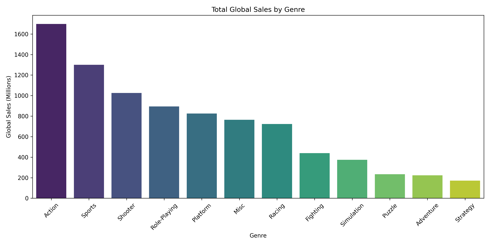
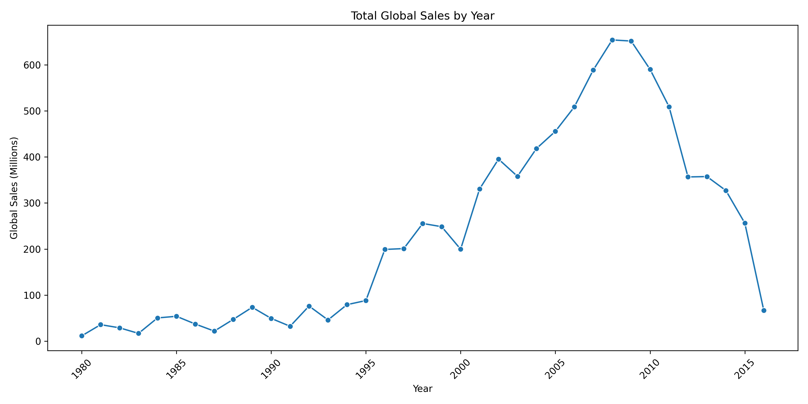
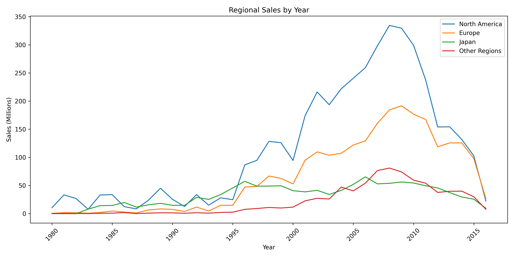
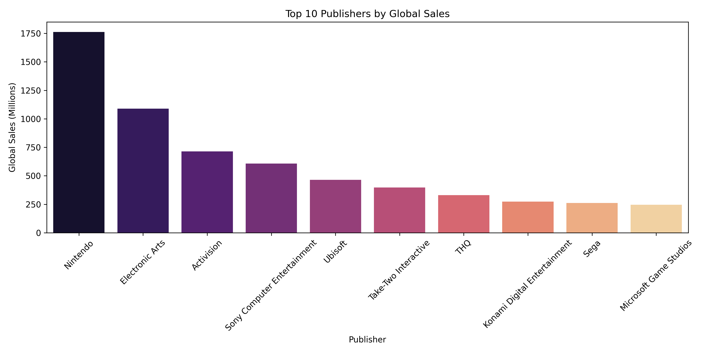
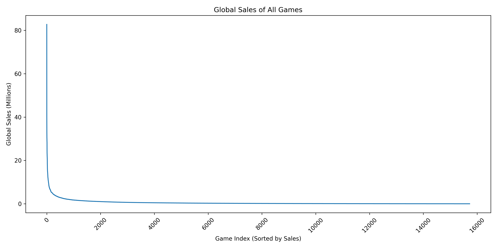

# Video Game Sales Exploratory Data Analysis (Python)

This project explores historical video game sales data using Python to identify trends in genres, regional markets, and publisher performance.

The goal is to demonstrate clean exploratory data analysis (EDA) practices using common Python data analysis tools such as pandas, NumPy, matplotlib, and seaborn.

---

## Project Overview

The dataset contains global video game sales from 1980–2016, including regional breakdowns for North America, Europe, Japan, and other markets.

This analysis focuses on answering several business-style questions:

- Which genres have historically been the most popular?
- How have video game sales evolved over time?
- How do regional markets differ in their preferences?
- Which publishers appear to be the strongest competitors?

The project emphasizes clear data cleaning, reproducible analysis, and well-structured exploratory insights.

---

## Tools and Libraries

- Python
- pandas
- NumPy
- matplotlib
- seaborn
- Jupyter Notebook

---

## Repository Structure

```
video-game-sales-eda-python/
│
├── data/
│   ├── raw/                # Original dataset
│   └── processed/          # Cleaned dataset
│
├── notebooks/
│   ├── data_inspection.ipynb
│   ├── data_cleaning.ipynb
│   └── exploratory_data_analysis.ipynb
│
├── visuals/                # Exported analysis charts
│
├── requirements.txt        # Project dependencies
└── README.md
```

---

## Data Cleaning

The cleaning process focuses on preparing the dataset for reliable analysis while avoiding unnecessary assumptions. Key steps include:

- Removing duplicate rows
- Dropping non-analytical columns
- Handling missing categorical values
- Removing rows with incomplete sales data
- Filtering invalid or missing release years

The cleaned dataset is saved for reproducible analysis.

---

## Example Analyses

The EDA explores several aspects of the video game market, including:

- Sales trends over time
- Genre popularity
- Regional sales differences
- Publisher performance

Visualizations are created using matplotlib and seaborn to highlight key patterns in the data.

---

## Key Visualizations

The analysis produces several visualizations that summarize major patterns in the dataset:

- Total Global Sales by Genre – compares overall popularity of game genres
- Total Global Sales by Year – shows the growth and peak of the video game market
- Regional Sales by Year – compares market size across North America, Europe, Japan, and other regions
- Top Publishers by Global Sales – identifies the dominant industry competitors
- Ranked Game Sales Curve – illustrates the "blockbuster" dynamic where a small number of games generate extremely large sales

All generated figures are saved in the `visuals/` directory.

## Key Insights

Several high‑level patterns emerge from the exploratory analysis:

- Action, Sports, and Shooter games account for the largest share of historical global sales, suggesting these genres have had the broadest market appeal.
- Global video game sales grew steadily through the 1990s and early 2000s, peaking around 2008–2009 before declining in the later years of the dataset.
- North America represents the largest regional market, followed by Europe, while Japan shows a smaller but distinct sales pattern.
- A small number of major publishers dominate the market, with companies such as Nintendo, Electronic Arts, and Activision responsible for a large share of total sales.
- Game sales follow a strong "blockbuster" distribution, where a small number of extremely successful titles generate a disproportionate share of total units sold.

---

## Visualizations

These charts are generated in the exploratory analysis notebook and exported to the `visuals/` folder.

### Genre Popularity



### Global Sales Over Time



### Regional Market Comparison



### Publisher Competition



### Blockbuster Sales Distribution



---

## How to Run the Project

1. Clone the repository

```
git clone https://github.com/spencerdavis226/video-game-sales-eda-python
cd video-game-sales-eda-python
```

2. Create a virtual environment and install dependencies

```
pip install -r requirements.txt
```

3. Open the notebooks

```
jupyter notebook
```

---

## Project Purpose

This project is part of a data analytics portfolio and demonstrates:

- structured exploratory data analysis
- transparent data cleaning practices
- clear and reproducible Python workflows

The focus is on producing clean, interpretable insights rather than building predictive models.
